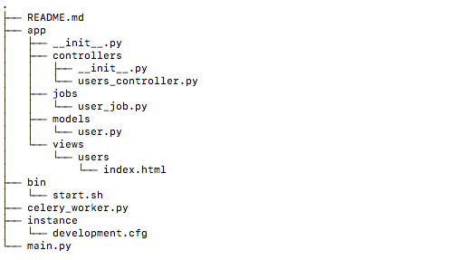

# Structor
Simple library that allow you to create templates of folders/files structure and generate them from a cli (like done in angular, django, react...)



Installation (not deployed yet):
- 

```shell script
  pip install structor
```

Create your template
-
Create your "template.yaml" file in a folder named ".structor" or you can simply run the command "structor" without arguments in your terminal. this will generate the folder and the yaml file.
- In this example, the command "structor init" will create all the folders and the files in the init section and the command "structor startapp" will create new modules/components
```yaml
---
commands:
  init:
    src:
    - __init__.py
    src > config:
    - __init__.py
    - config.py
    - local_config.py.dist
    src > modules:
    - __init__.py
    src > static: []
  startapp:
    src > modules > {{APP-NAME}}:
    - __init__.py
    - "{{APP-NAME}}.py"
replacement:
  "{{APP-NAME}}": "**1"
file-template:
  src > modules > {{APP-NAME}} > {{APP-NAME}}.py: "my_template_file.py.struct"
```

- The values "**1", "**2"... will be replaced by the arguments passed in the cli.
- All values put in the "replacement" section will be replaced in the folders/files and files content.
- The "file-template" section allow you to init the created files from a file template