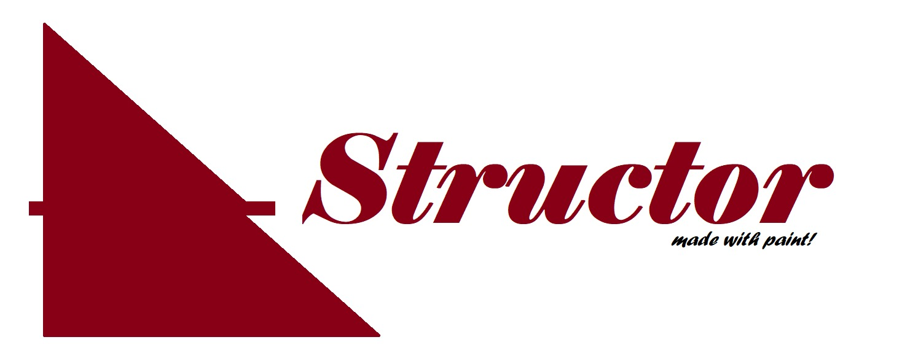
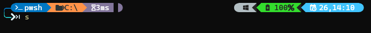

<p align="center">
  <a></a>
</p>
<p align="center">
    <em>Simple library that allow you to create templates of folders/files structure and generate them from a cli (like done in angular, django, react...)</em>
</p>

---

Installation:
-
### On macOS

```shell script
brew install pipx
pipx ensurepath
pipx install structor
```

### On Linux, install via pip (requires pip 19.0 or later)

```shell script
python3 -m pip install --user pipx
python3 -m pipx ensurepath
pipx install structor
```

### On Windows, install via pip (requires pip 19.0 or later)

```shell script
# If you installed python using the app-store, replace `python` with `python3` in the next line.
# If you have a pre-installed version on windows replace `python` with `py`
python -m pip install --user pipx
python -m pipx ensurepath
pipx install structor
```

Initialization
-
Run the command "structor init" to initialize a sample template. this will generate the folder and the yaml file.


- In this example, the command "structor run startproject" will create all the folders and the files in the startproject section and the command "structor run addmodule my_new_module" will create new modules/components
```yaml
---
commands:
  startproject:
    src:
    - __init__.py
    src > config:
    - __init__.py
    - config.py
    - local_config.py.dist
    src > modules:
    - __init__.py
    src > static: []
  addmodule:
    src > modules > {{APP-NAME}}:
    - __init__.py
    - "{{APP-NAME}}.py"
    - "models.py"
    - "views.py"
    - "controllers.py"
replacement:
  "{{APP-NAME}}": "**1"
file-template:
  src > modules > {{APP-NAME}} > {{APP-NAME}}.py: "my_template_file.py.struct"
```

- The values "**1", "**2"... will be replaced by the arguments passed in the cli.
- All values put in the "replacement" section will be replaced in the folders/files and files content.
- The "file-template" section allow you to init the created files from a file template
